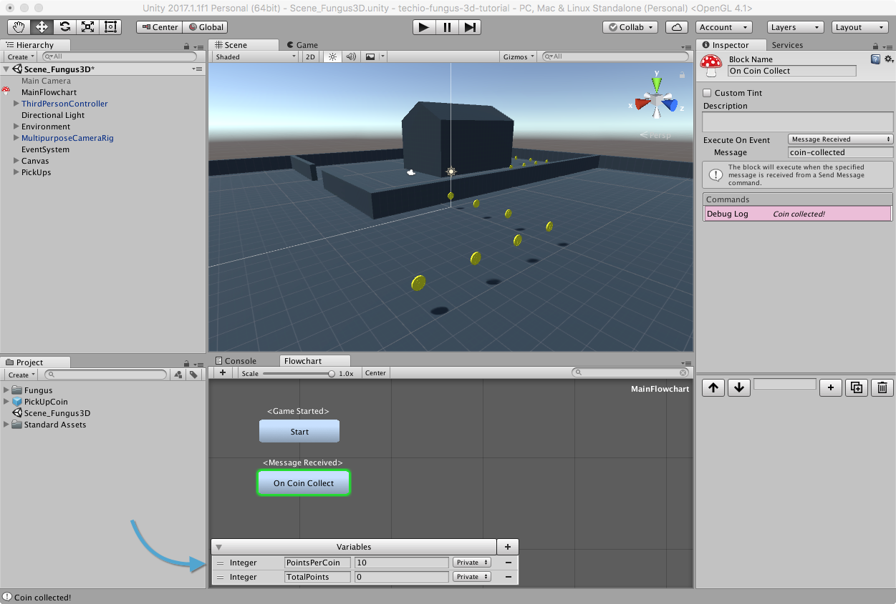
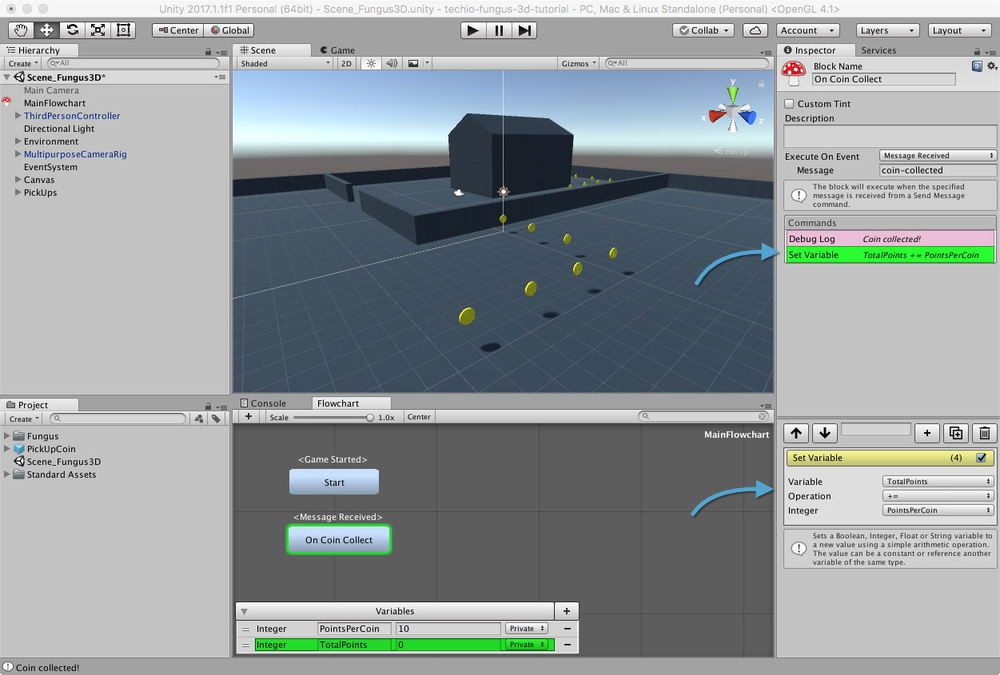
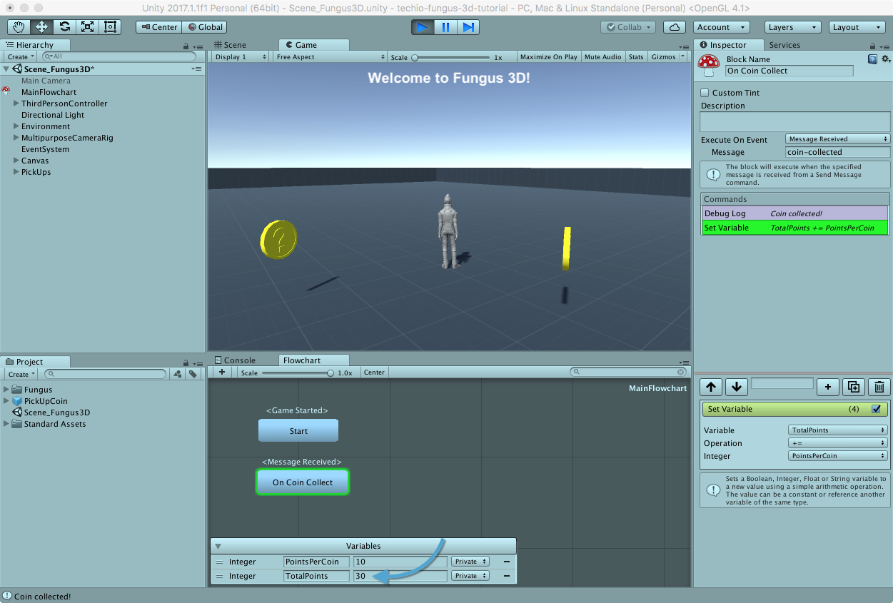

# Tenere Traccia dei Punti

Dobbiamo ora andare a visualizzare in scena il numero di punti totalizzati per la raccolta delle monete.

## Creare le Variabili

Ci servono innanzitutto due variabili per tenere traccia di:

* quanti punti assegnare ogni volta che si raccoglie una moneta
* quanti punti totali sono stati accumulati

Apriamo il _MainFlowchart_ e, dalla sezione _Variables_, tramite il pulsante _+_, creiamo due variabili di tipo _integer_ che chiameremo, rispettivamente, _PointsPerCoin_ e _TotalPoints_.
Assegnamo a _PointsPerCoin__ il valore 10.

## Aggiornare i Punti 

Siamo già in grado di sapere quando una moneta viene raccolta... nello stesso blocco possiamo quindi assegnare i punti corrispondenti.
Selezioniamo il blocco _On Coin Collect_ ed aggiungiamo il comando _Variable > Set Variable_, che ci permette di assegnare un valore ad una variabile.
La variabile in questione è _TotalPoints_ cui dobbiamo aggiungere (_+=_) ogni volta che questo blocco viene eseguito i _PointsPerCoin_.

Salviamo e lanciamo la scena: ogni volta che raccoglieremo una moneta, la nostra variabile _TotalPoints_ verrà aggiornata.

## Visualizzare i Punti nella UI

[TBD]

